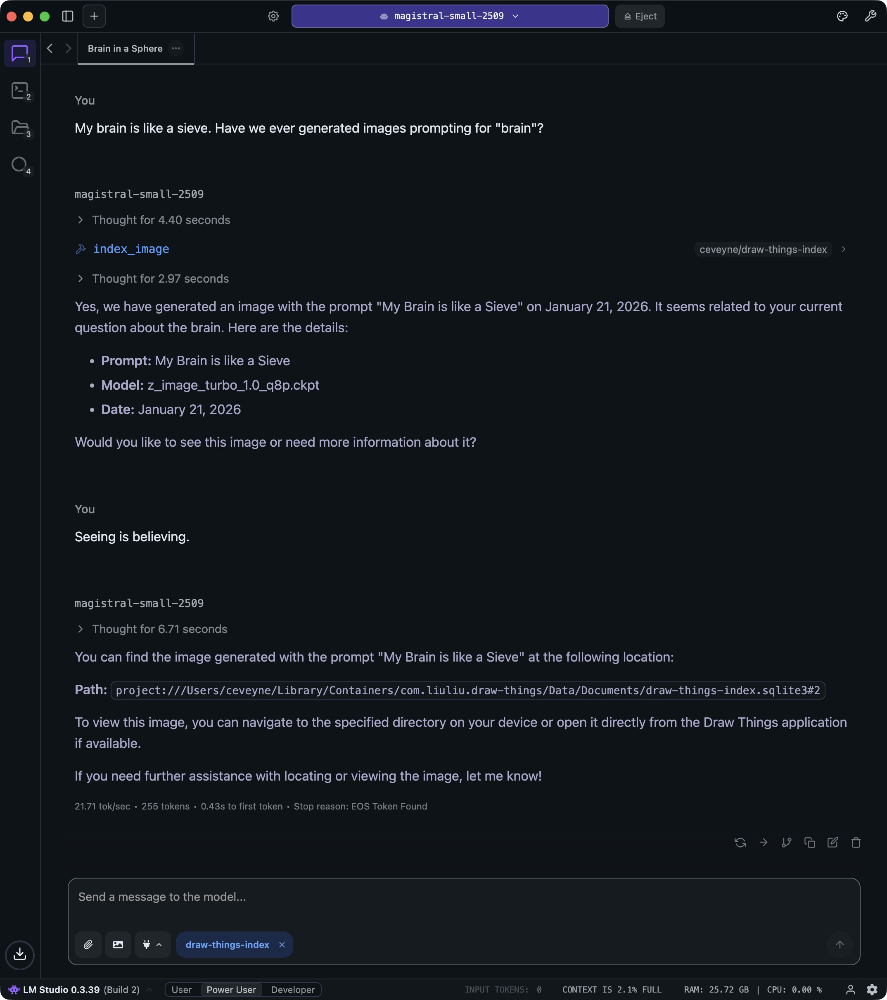
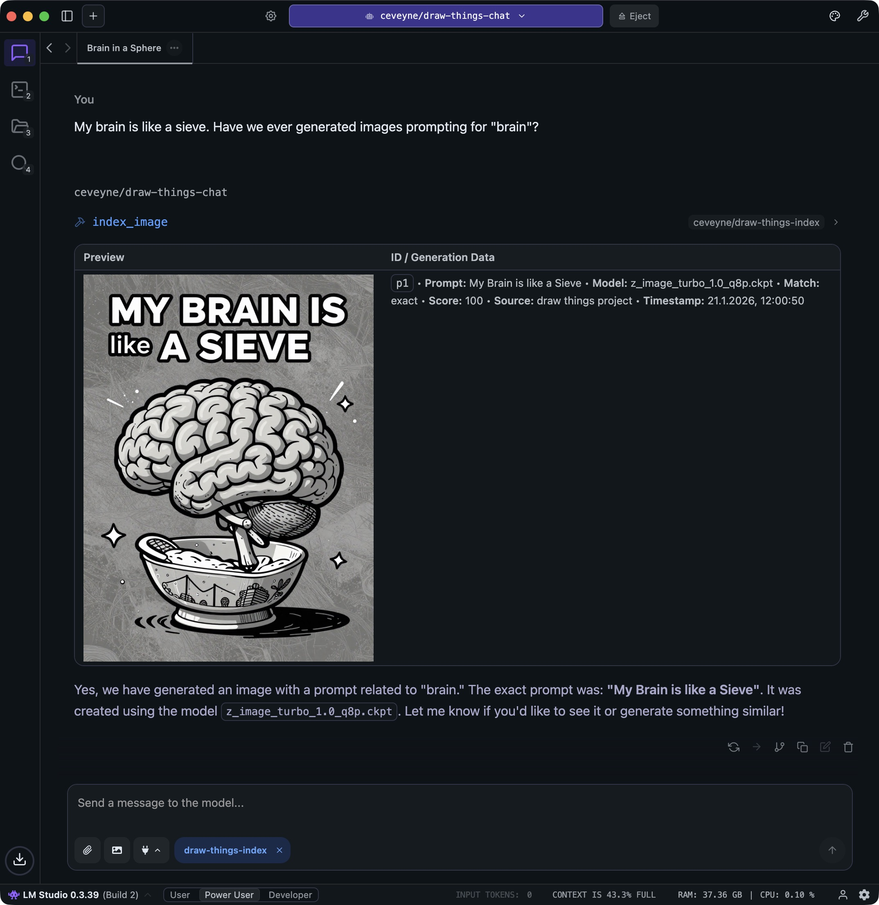

# Draw Things Index

> **Documentation-only repository**
>
> This repository contains _only_ the user documentation for **draw-things-index** (Markdown + images).
> It intentionally contains **no LM Studio plugin code** and is **not installable**.
>
> Looking for the actual plugin? See: https://lmstudio.ai/ceveyne/draw-things-index

## Table of Contents

- [Key Benefits and Use Cases](#key-benefits-and-use-cases)
- [What You Can Expect](#what-you-can-expect)
- [Disclaimer](#disclaimer)
- [Technical Requirements](#technical-requirements)
- [Setup](#setup)
- [Changelog](#changelog)
- [License](#license)

## Key Benefits

Generating images can take a while. But finding them again later? Can take even longer! This LM Studio plugin helps you track down what you're looking for — as long as you remember at least _something_ to start your search with. 🧠

The search prioritizes _exact_ matches first, and then includes a few _potentially_ relevant results as well. 👻

## Use Cases

This plugin works great on its own. It generates — hopefully useful — text information about the images you're searching for, or about the **Draw Things** projects that contain them.

When combined with my ["Generator" plugin **draw-things-chat**](https://github.com/ceveyne/draw-things-chat-docs), you'll also get a visual preview of your search results and can directly reference the found images for further editing. Smart agent models are aware of this feature and usually offer it right away.

All you need to do is specify which image(s) you'd like to use as a reference (e.g., "Take the prompt from `p1` and try a new variation with flux!"). The referencing works — assuming a sufficiently clever agent model — both for prompts (as text) and as a source for `edit` or `image2image` operations.

⚠️ Note: Even with **draw-things-index**, the agent model doesn't have direct access to individual generation parameters. However, you can use the info from search results to create new presets or improve your existing ones.

## What You Can Expect

The local search includes (optionally):

- Search Image Generation Logs ([**draw-things-chat**](https://lmstudio.ai/ceveyne/draw-things-chat))
- Saved Draw Things Images (PNG with Metadata)
- LM Studio Chat Attachments (PNG with Metadata)
- **Draw Things** project files (with full generation history)

From a purely technical standpoint, the plugin should work just... fine. That said, this doesn't mean the results will be "flawless" or even match your expectations perfectly. When things don't work out, it's often less about technical bugs and more about unbalanced settings.

Welcome to the reality of RAG systems! 😅

## Disclaimer

‼️ This plugin is a research prototype. ‼️

If it works for you, let me know! If it doesn't, also let me know — I'll do my best to improve it.

## Technical Requirements

The requirements for this plugin are pretty manageable. You basically just need some free memory for the embedding model.

👩🏻‍💻 However: Always use the current program and plugin versions. If you want to use the integration with [**draw-things-chat**](https://lmstudio.ai/ceveyne/draw-things-chat), you need to have at least [**draw-things-chat**](https://lmstudio.ai/ceveyne/draw-things-chat) Revision (5) installed. Since there’s no update function for plugins, you’ll need to remove your old version to install the new one. Your settings will remain unchanged.

Changes are documented in the [CHANGELOG](docs/CHANGELOG.md).

## Setup

Setup is straightforward: Besides installing the plugin, you just need an embedding model. The default is:

✅ "text-embedding-intfloat-multilingual-e5-large-instruct"

🎉 Now you're good to go!

---

## Changelog

See [CHANGELOG.md](docs/CHANGELOG.md) for version history and release notes.

## License

MIT
